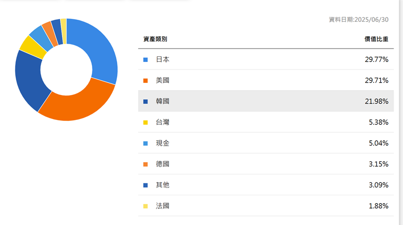
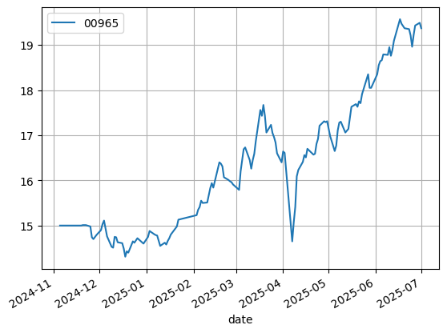
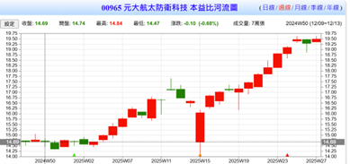
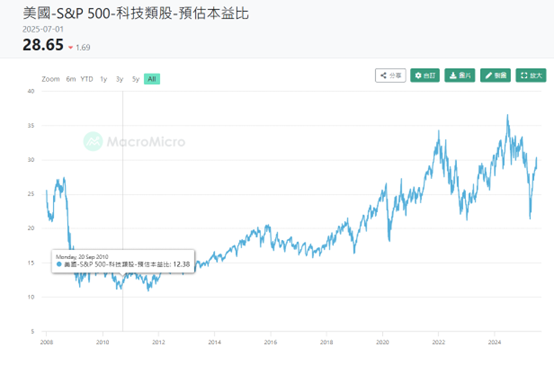
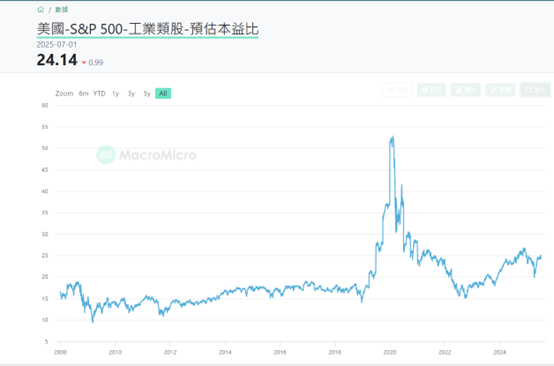
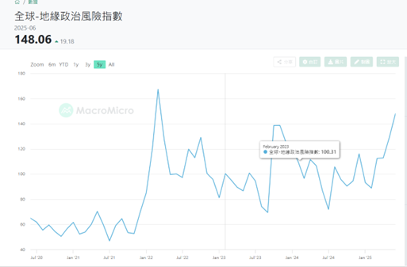

# 元大全球航太防衛科技ETF 分析大綱

## 基金基本資料

- **基金名稱**：元大全球航太與防衛科技ETF
- **成立日期**：2024年11月5日
- **基金類型**：指數股票型基金（跨國、股票型）
- **經理人**：李政剛
- **基金規模**：約新台幣97.32億元
- **保管銀行**：彰化商業銀行
- **經理費**：0.90%
- **保管費**：0.14%–0.16%

---

## 投資目標與策略

- 追蹤 **NYSE FactSet 全球航太與防衛科技指數**。
- 主要投資全球範圍內提供航太、防衛科技相關產品和服務的公司。
- 屬於主題型投資，產業風險集中於「航太與國防」與「資訊科技」。
- 單一成分股權重上限5%，各區域（美洲與EMEA、亞太）權重各上限50%，風險較傳統市值型指數分散。
- 目標是在合理風險下複製指數表現、取得中長期資本利得及收益。

---

## 主要持股（前十大）

| 名次 | 持股名稱                    | 權重 (%) |
|----|---------------------------|--------|
| 1  | MITSUBISHI HEAVY INDUSTRIES | 9.52   |
| 2  | NEC CORP                    | 6.63   |
| 3  | HANWHA AEROSPACE CO LTD     | 6.16   |
| 4  | IHI CORP                    | 5.49   |
| 5  | FUJITSU LIMITED             | 4.90   |
| 6  | HANWHA SYSTEMS CO LTD       | 4.42   |
| 7  | GENERAL ELECTRIC            | 4.28   |
| 8  | 台積電 (TSMC)                 | 4.22   |
| 9  | MITSUBISHI ELECTRIC CORP    | 4.18   |
| 10 | NVIDIA CORP                 | 3.51   |

---

## 區域配置

 

---

## 產業配置

| 產業類別   | 比重 (%) |
|----------|--------|
| 工業       | 68.63  |
| 資訊科技    | 27.82  |
| 原材料     | 0.29   |
| 現金       | 3.26   |

---

## 歷史資料（2025年至今）

### 績效指標比較

| 指標          | 00965 (元大全球航太防衛) | 0050 (台灣50) |
|---------------|------------------------|---------------|
| Annual Return | 19.14%                 | 9.54%         |
| Volatility    | 17.32%                 | 16.68%        |
| Sharpe Ratio  | 1.11                   | 0.57          |

---

### Risk 指標

> 
- **1-Day VaR (95%)**: ±1.7274%

---

### 基本面估值

- 00965 本益比（P/E）：14.69

>   
>   
>   

---

## 題材面
 
- **主題**：軍工股 + 科技股
- **地緣政治事件**：加薩走廊、烏克蘭戰爭

---

## 投資定位

1. **Buy & Hold**：可以對沖部分戰爭風險，同時保有高科技股的成長動能。
2. **動態持有**：配合投資人恐慌情緒、Google Trends、VIX、新聞數量等指標做調整。

---

## 要注意的地方

- 國際上有 **ESG 偏好** 的趨勢：國防產業常遭 ESG 基金排除，若全球資金偏好 ESG，評價倍率可能受壓抑。

---
