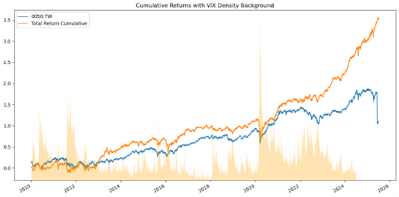
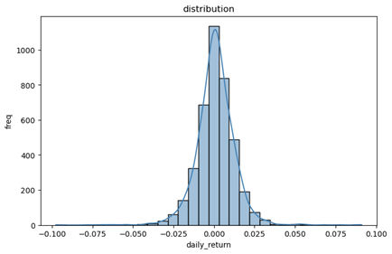

# 元大全球航太防衛科技ETF 分析大綱

## 基金基本資料

- **基金名稱**：元大全球航太與防衛科技ETF
- **成立日期**：2024年11月5日
- **基金類型**：指數股票型基金（跨國、股票型）
- **經理人**：李政剛
- **基金規模**：約新台幣97.32億元
- **保管銀行**：彰化商業銀行
- **經理費**：0.90%
- **保管費**：0.14%–0.16%

---

## 投資目標與策略

- 追蹤 **NYSE FactSet 全球航太與防衛科技指數**。
- 主要投資全球範圍內提供航太、防衛科技相關產品和服務的公司。
- 屬於主題型投資，產業風險集中於「航太與國防」與「資訊科技」。
- 單一成分股權重上限10%，各區域（美洲與EMEA、亞太）權重各上限50%，風險較傳統市值型指數分散。
- 目標是在合理風險下複製指數表現、取得中長期資本利得及收益。

---

## 主要持股（前十大）

| 名次 | 公司 | 股票代號 | 所在國 | 權重 (%) | 軍工相關業務 |
|----:|:--------------------------------|:-----------|:--------|:--------|:------------------------------------|
| 1 | **Mitsubishi Heavy Industries** 三菱重工 | TSE: 7011 | 🇯🇵 日本 | **9.52** | 飛彈、航空發動機、艦艇、太空發射器 |
| 2 | **NEC Corp** | TSE: 6701 | 🇯🇵 日本 | **6.63** | AESA 雷達、指揮控制、網路防禦 |
| 3 | **Hanwha Aerospace** | KRX: 012450 | 🇰🇷 南韓 | **6.16** | 發動機、K9 自走砲、飛彈推進器 |
| 4 | **IHI Corp** | TSE: 7013 | 🇯🇵 日本 | **5.49** | 戰機發動機、火箭、SAR 衛星 |
| 5 | **Fujitsu Limited** | TSE: 6702 | 🇯🇵 日本 | **4.90** | ICT 後勤、AI 指揮系統、資安 |
| 6 | **Hanwha Systems** | KRX: 272210 | 🇰🇷 南韓 | **4.42** | 雷達、電子戰、反無人機整合 |
| 7 | **GE Aerospace** (General Electric) | NYSE: GE | 🇺🇸 美國 | **4.28** | 渦扇/渦軸發動機、混合電動推進 |
| 8 | **台積電** (TSMC) | NYSE: TSM | 🇹🇼 台灣 | **4.22** | 先進製程晶圓與 CoWoS 封裝 |
| 9 | **Mitsubishi Electric** 三菱電機 | TSE: 6503 | 🇯🇵 日本 | **4.18** | 艦載/陸基 AESA 雷達、感測器 |
| 10 | **NVIDIA Corp** | NASDAQ: NVDA | 🇺🇸 美國 | **3.51** | AI GPU 加速、國防 HPC 平台 |

---

## 區域配置

---

## 產業配置

| 產業類別   | 比重 (%) |
|----------|--------|
| 工業       | 68.63  |
| 資訊科技    | 27.82  |
| 原材料     | 0.29   |
| 現金       | 3.26   |

---

## 歷史資料（2024年11月etf上市至今）
  
### 用前10大權重股票模擬歷史績效 (2010年至今)

| 指標          | 00965 (元大全球航太防衛) | 0050 (台灣50) |
|---------------|------------------------|---------------|
| Annual Return | 19.14%                 | 9.54%         |
| Volatility    | 17.32%                 | 16.68%        |
| Sharpe Ratio  | 1.11                   | 0.57          |

---

### Risk 指標

> 
- **1-Day VaR (95%)**: ±1.7274%

---

### 基本面估值

- #### 00965 本益比（P/E）：14.69

>   
>   
>   

---

## 題材面
 
- **主題**：軍工股 + 科技股
- **地緣政治事件**：加薩走廊、烏克蘭戰爭

---

## 投資定位

1. **Buy & Hold**：可以對沖部分戰爭風險，同時保有高科技股的成長動能。
2. **動態持有**：配合投資人恐慌情緒、Google Trends、VIX、新聞數量等指標做調整。

---

## 要注意的地方

- 國際上有 **ESG 偏好** 的趨勢：國防產業常遭 ESG 基金排除，若全球資金偏好 ESG，評價倍率可能受壓抑。

---
